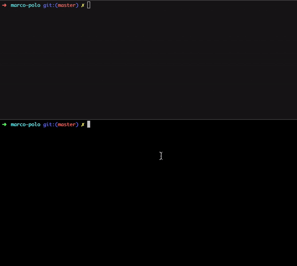

# Pensieve

> “I sometimes find, and I am sure you know the feeling, that I simply have too many thoughts and memories crammed into my mind.”
> It's easy to get overloaded with memories and thoughts of our past. That'e when you need to relax, take a deep breath, and empty
> some of them out into a Pensieve... that is, if you have one.

Creates a development environment within a Kubernetes cluster by replacing one of your deployments with a docker container
built for development, and gives you back a shell you can run any commands you'd like.

Here a gif demonstrating the tool:

